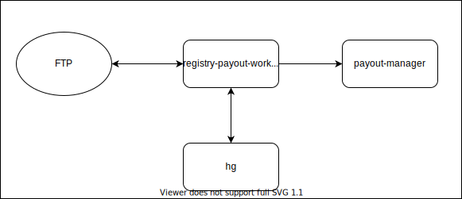

# registry-payout-worker

Сервис для формирования выплат из реестров.

## Описание работы сервиса

registry-payout-worker - сервис, предназначенный для формирования выплат из реестров провайдера.
Сервис взаимодействует с ftp, hellgate и payout-manager

### Взаимодействие с ftp

Файлы реестров, полученные от провайдера, помещаются в директорию для провайдера.
Сервис читает файлы реестров из директории, в зависимости от названия директории выбирает обработчик для реестров, 
считывает операции. После прочтения файлы перемещаются в директорию для обработанных реестров.

### Взаимодействие с hellgate

Сервис запрашивает hellgate для получения party и shop
 по операциям и группирует ранее полученные из реестра операции по party, shop.

### Взаимодействие с сервисом payout-manager

Протокол взаимодействия описан [тут](https://github.com/rbkmoney/payout-manager-proto).
Сервис расчитывает сумму и валюту выплаты для магазина на основе сгруппированных ранее данных
и отправляет запрос к сервису payout-manager.

Общая схема взаимодействия отображена ниже:

